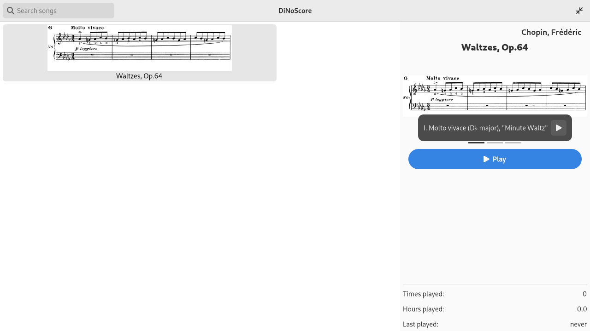
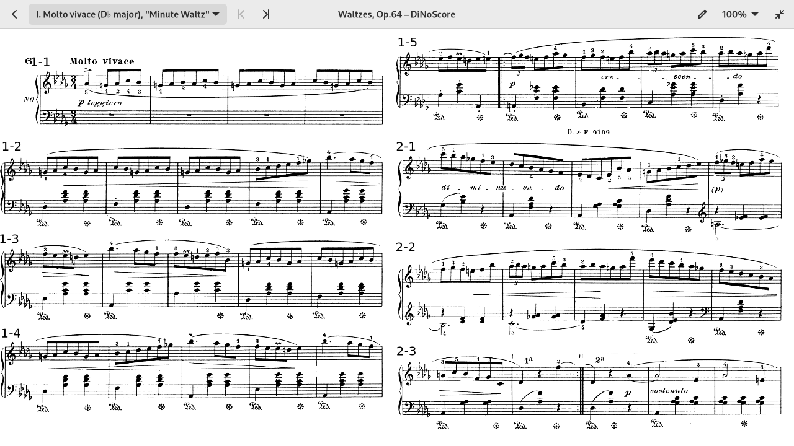
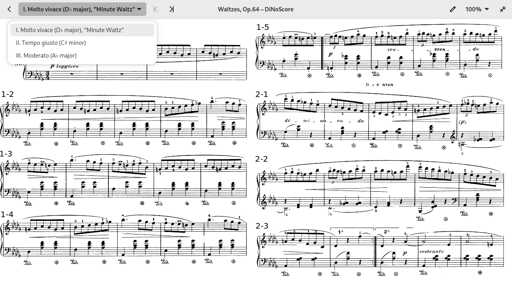
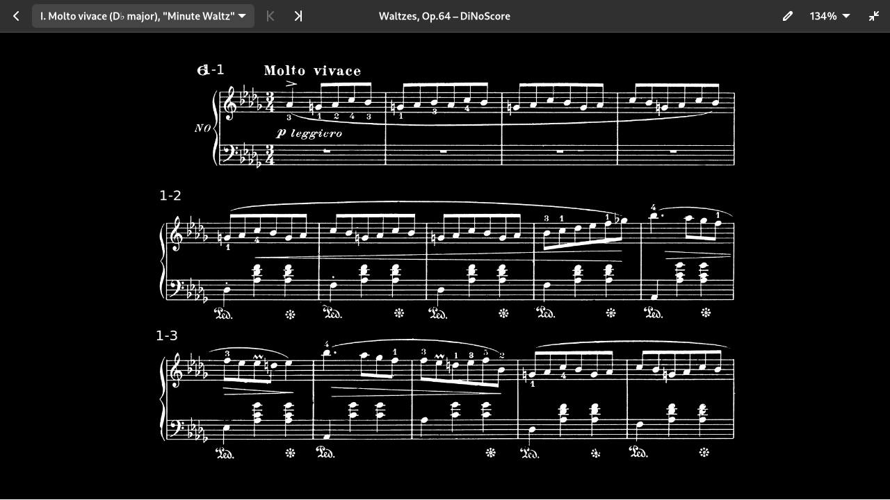

# DiNoScore*

A digital music stand written in Rust with Gtk 4 and Libadwaita. It is comparable to *forScore*, but completely free\*\*. Touch screen is optional but recommended.

\* **Di**gital **No**te **Score**. Never let anything stop you from a good acronym :D

\*\* Not only is it free, it also works on relatively low budget hardware.

## Features

- Probably the only open source digital music stand software out there
- Adaptive layout that shows a configurable amount of staves per page (see screenshots below)
  - Change the "font size" according to your needs
  - It can also show multiple columns if you wish
- Easily add annotations in [Xournal++](https://xournalpp.github.io/)
- A companion application, the Editor, to import PDFs and images into the custom DiNoScore format
- Night mode

### Planned features (help appreciated)

- Graceful error handling — sorry, at the moment the application just crashes if something ever goes wrong :D
- [Setlists](https://en.wikipedia.org/wiki/Set_list)
- Synchronized or remote page turning
	- Automatic page turning via score following?
- Four hands mode/duet on single device?
- Song detection (just start playing and it will load the song for you)
- Video recording mode: All those YouTube videos which display the score alongside the music could be recorded with DiNoScore

## Gallery

Song library:

A loaded song:

Jump between movements/sections/songs:

Layout with larger zoom factor for smaller devices:

Dark mode:

Import your scores using the editor:

## How it works

Cool features that assist you while playing need to be backed by data. Fully typeset files, for example in the MusicXML format, would contain all the information needed in a machine readable format. However, getting those is pretty difficult and/or expensive. Since DiNoScore wants to be affordable, you should be able to import image-based scores so that it'll even work with paper scans.

In order to still provide those features, you are required to annotate some information onto the score. Among other things, the software needs to know the boundaries of all the staves on the sheets. Since annotating all those by hand would be slow and tedious, we use a bit of object detection to automate the process. You'll only be required to do a few manual fixes.

With this information, DiNoScore can cut out the individual pages from the sheets and stitch them back together in the way that fits your display the best. Also, when you turn back a page because of a repetition, it will automatically jump to the beginning of the repetition even though it may be multiple pages away.

## Get it

(See "Development" below if you want to get the latest source build)

Packaging for Nix, Arch Linux and Flatpak is work in progress.

Windows users need to download a zip bundle from the CI or the releases. (For the CI, click on a commit, on the green check mark, "Summary", scroll down to "Artifacts".)

## Usage

Songs are packed in a custom file format stored as zip files. The program lists everything in `$XDG_DATA_DIRS/dinoscore/songs`, so simply put your songs into `$XDG_DATA_HOME/dinoscore/songs`. If you don't know what `XDG_DATA_HOME` is, use `~/.local/share/dinoscore/songs` instead. You can create song files [using the editor](./editor.md) or download some from our [public collection](https://github.com/DiNoScore/Scores).

When using a foot switch to turn the page, bind the page turning actions to `Alt+n` (next) and `Alt+p` (previous). The arrow keys will work too.

There's also a small CLI for utility stuff. At the moment, the only feature it has is to bulk-upgrade song files to the newest version of the format. Run it with `dinoscore-cli upgrade --help` (or in development, with `cargo run --locked --release --bin cli -- upgrade --help`).

## Development

If you've installed Nix, simply type `nix-shell` and you're good to go. Power users may prefer [`direnv allow`](http://direnv.net/). Otherwise, install the required dependencies manually.

- **Run the application**: `cargo run --locked --release`
- Run the editor: `cargo run --locked --release --bin editor`

## License

This work is licensed under the EUPL v1.2 or later. Parts of the library, notably the file format, the layout engine and the staff recognition, are additionally dual-licensed under the MPL.

Contact the owner(s) for use in proprietary software.
