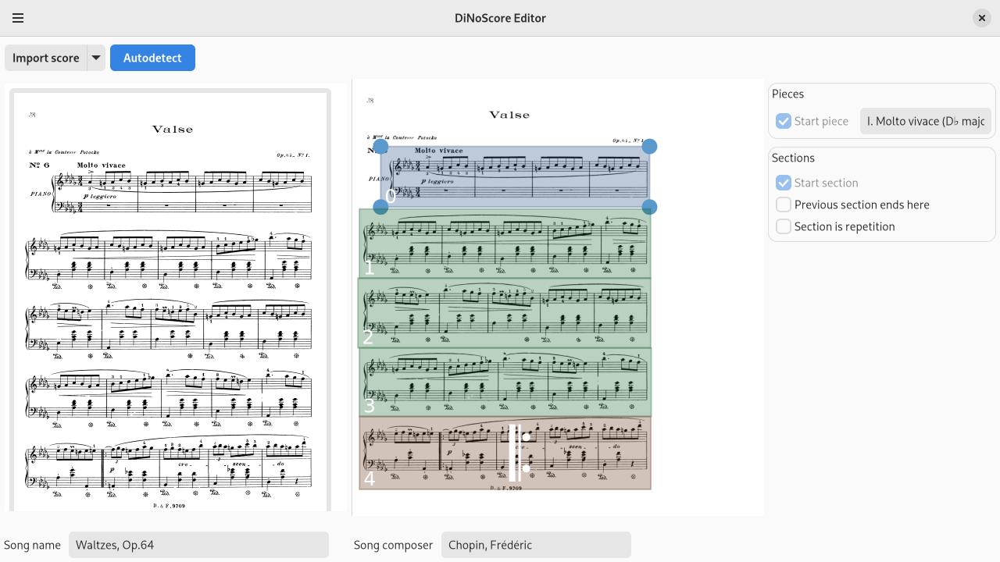
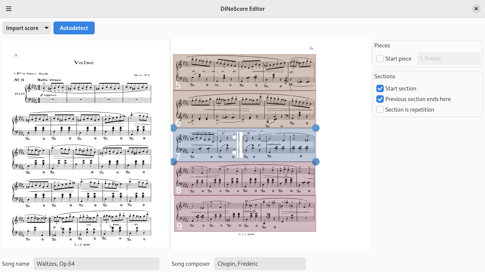

# Import sheets in the editor

First, you need to prepare some music sheets for importing: [Getting sheets prepared for DiNoScore](./sheets.md).

## Load the pages

You can import image files as well as PDFs ("Add pages"). By default, the editor will assume that your PDF contains some embedded image files (this is for example the case for most scanned scores) and try to extract them.

If your PDF is a "true" vector file, as you would get for example from MuseScore, then use "Import raw PDF files" instead. This will skip the extraction process. You can also use this for PDFs that embed images but where the extraction fails for some reason.

If in doubt, just use the default "Add pages" button and fall back to "Import raw PDF files" if that doesn't work (and your file is a PDF).

## Annotate staff boundaries

For the viewer to correctly display the content, you need to tell it where the individual staves are on the imported images. Every annotation is a box declaring the position and size of the staff.

Select all pages that contain staves, and click "Autodetect". This will take a while. Note that the automatic detection is performed by some online service, because it is somewhat tricky to get to work (and it requires quite a bit of additional disk space). But you can run it locally if you prefer to: https://github.com/DiNoScore/OMR-MeasureRecognition

Now, go through the pages and check that all annotation boxes are at the correct place:
- Every box should cover all music note pixels that belong to it.
- Boxes may overlap vertically if necessary, this is not an issue.
  - The automatic detection is pretty generous to make sure all relevant pixels are included, but sometimes it may miss a few and you need to expand the area a bit more. Especially text and footnotes are often missed.
  - If you want to put in the extra effort, you can reduce the area if it goes too far into the pixels of the next or previous staff.
- The annotation process may fail in rare cases, in which you can add the staff annotations manually with the mouse.

## Annotate sections and repetitions

You can optionally add structure information about the imported music to the individual staves.

You can modify the information of a staff by clicking on it:

- For each "song" in the sheets, click "part start" and give it a name.
- Use "start section" to divide the song further. Create at least one section for each repetition.
- Click "is repetition" on the first section of every repetition

